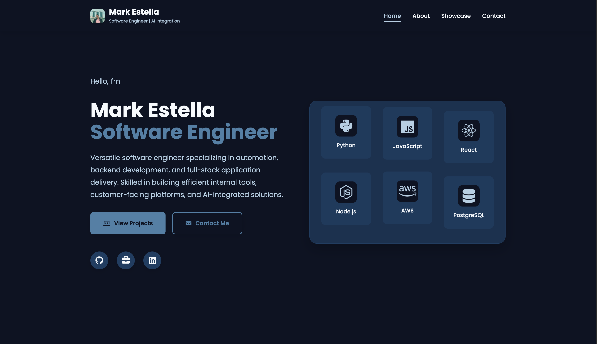

# Mark Estella - Portfolio

A modern, terminal-themed portfolio built with Next.js, TypeScript, and Tailwind CSS. Features a unique developer-centric design inspired by bash terminal aesthetics.



## ✨ Features

- **Terminal/Code Aesthetic**: Dark theme with bash terminal color palette
- **Interactive UI**: Typewriter effects, animated counters, and hover states
- **Code-like Displays**: Projects, certificates, and tech stack displayed as code snippets
- **Responsive Design**: Fully responsive across all devices
- **Contact Form**: SMTP-powered contact form with validation
- **SEO Optimized**: Meta tags and OpenGraph support
- **Performance**: Optimized images and lazy loading

## 🛠️ Tech Stack

- **Framework**: Next.js 16 (App Router)
- **Language**: TypeScript
- **Styling**: Tailwind CSS
- **Fonts**: JetBrains Mono (monospace), Inter (sans-serif)
- **Email**: Nodemailer for SMTP

## 🚀 Getting Started

### Prerequisites

- Node.js 18.17 or later
- npm, yarn, pnpm, or bun

### Installation

1. Clone the repository:
```bash
git clone https://github.com/markestella/portfolio.git
cd portfolio/nextjs-portfolio
```

2. Install dependencies:
```bash
npm install
```

3. Set up environment variables:
```bash
cp .env.example .env.local
```

4. Configure your SMTP settings in `.env.local`:
```env
SMTP_HOST=smtp.gmail.com
SMTP_PORT=587
SMTP_SECURE=false
SMTP_USER=your-email@gmail.com
SMTP_PASS=your-app-password
SMTP_FROM=your-email@gmail.com
CONTACT_EMAIL=your-email@gmail.com
```

5. Run the development server:
```bash
npm run dev
```

6. Open [http://localhost:3000](http://localhost:3000) in your browser.

## 📁 Project Structure

```
nextjs-portfolio/
├── public/               # Static assets
│   ├── certificates/     # Certificate images
│   ├── project_images/   # Project screenshots
│   └── tech_stack/       # Technology icons
├── src/
│   ├── app/              # Next.js App Router pages
│   │   ├── about/
│   │   ├── contact/
│   │   ├── projects/
│   │   └── api/contact/  # Contact form API route
│   ├── components/
│   │   ├── cards/        # Card components
│   │   ├── layout/       # Header, Footer
│   │   ├── sections/     # Page sections
│   │   └── ui/           # Reusable UI components
│   └── data/             # Static data files
```

## 🎨 Color Palette

Terminal-inspired colors based on ANSI color codes:

| Color | Hex | Usage |
|-------|-----|-------|
| Green | `#3fb950` | Primary accent, success states |
| Cyan | `#39c5cf` | Secondary accent, links |
| Blue | `#58a6ff` | Links, highlights |
| Yellow | `#d29922` | Warnings, dates |
| Red | `#f85149` | Errors, close buttons |
| Magenta | `#bc8cff` | Keywords, special text |

## 📦 Deployment

### Deploy to Vercel

1. Push your code to GitHub
2. Import your repository in [Vercel](https://vercel.com)
3. Add environment variables in Vercel project settings
4. Deploy!

[](https://vercel.com/new/clone?repository-url=https://github.com/markestella/portfolio)

## 📧 Contact Form Setup

The contact form uses SMTP to send emails. For Gmail:

1. Enable 2-Factor Authentication on your Google account
2. Generate an App Password: Google Account → Security → App Passwords
3. Use the app password as `SMTP_PASS`

## 📄 License

MIT License - feel free to use this template for your own portfolio!

## 👨‍💻 Author

**Mark Estella**
- GitHub: [@markestella](https://github.com/markestella)
- LinkedIn: [markdestella98](https://linkedin.com/in/markdestella98)
- Email: mark.estella09@gmail.com

## Deploy on Vercel

The easiest way to deploy your Next.js app is to use the [Vercel Platform](https://vercel.com/new?utm_medium=default-template&filter=next.js&utm_source=create-next-app&utm_campaign=create-next-app-readme) from the creators of Next.js.

Check out our [Next.js deployment documentation](https://nextjs.org/docs/app/building-your-application/deploying) for more details.
